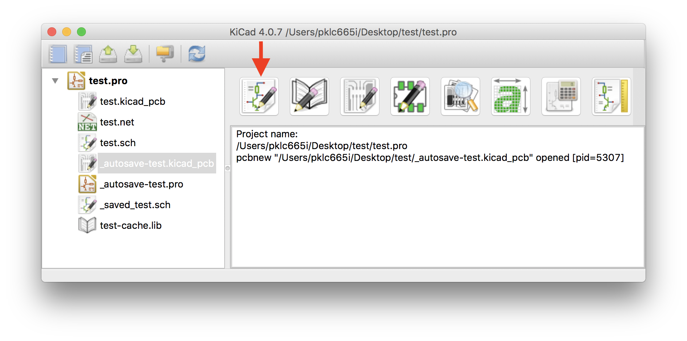
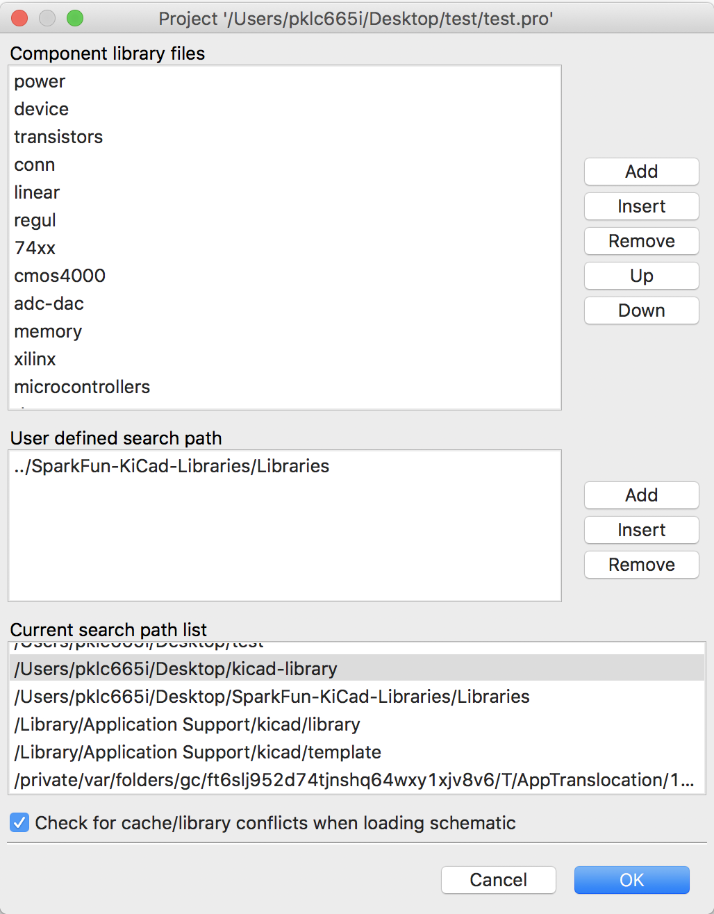
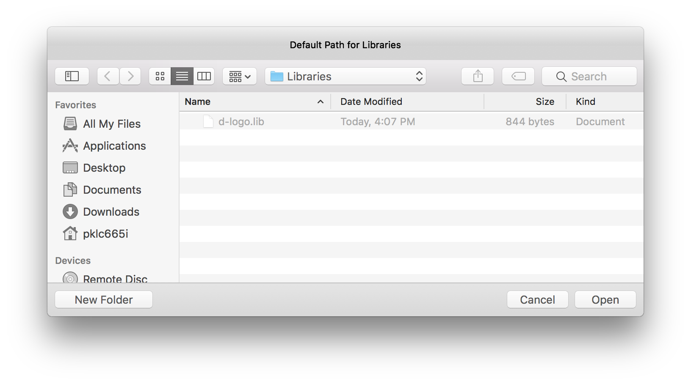
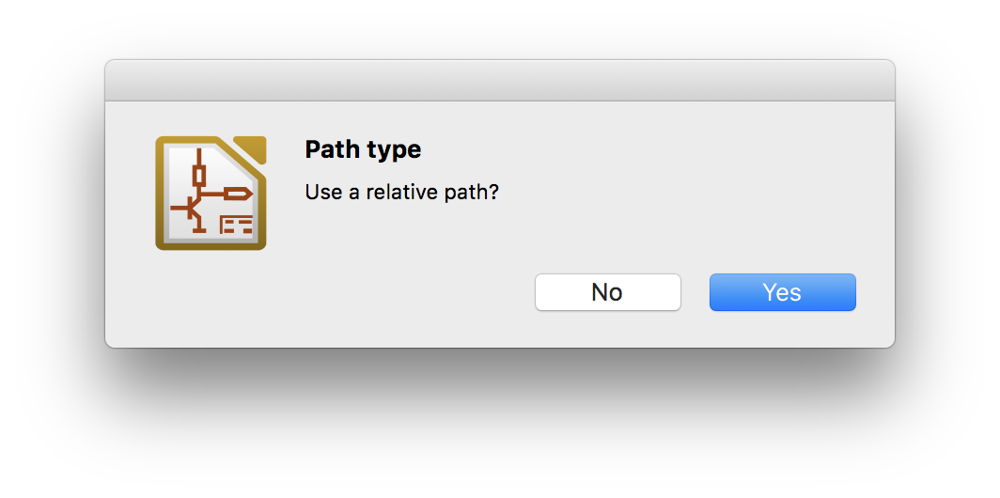
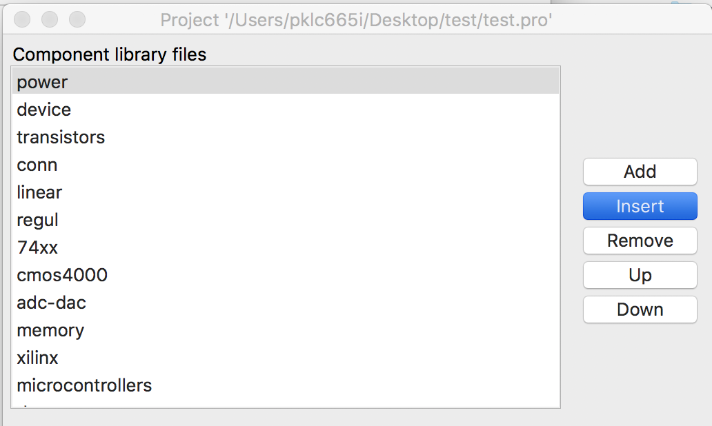
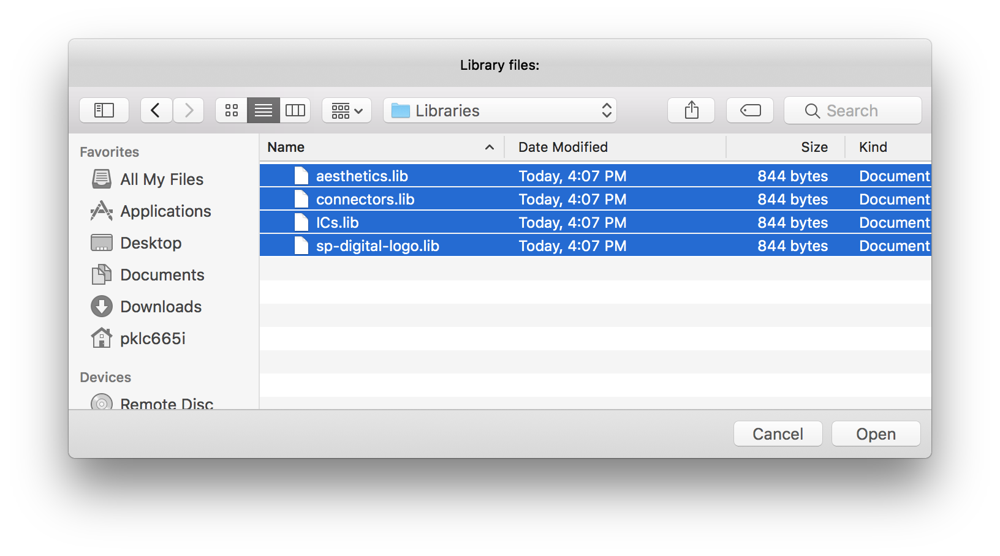

#### Importing libraries

1. Launch the KiCad app on MacOS
1. Click on `Eeschema`, the tool for schematic capture

1. Click on `Preferences` --> `Component Libraries`

1. Click on `Add` under **User defined search path**
1. Navigate to the `Libraries` folder in this repository and click `Open`

1. When prompted to use relative path, select **NO**

1. Select the first library under **Component library files** at the top of the list and click on "Insert"
 - It is important to follow these steps so that imported libraries are prioritised by being placed at the top.

 

1. Select all the library files in the "Libraries" folder and click **Open**

#### Importing footprints
